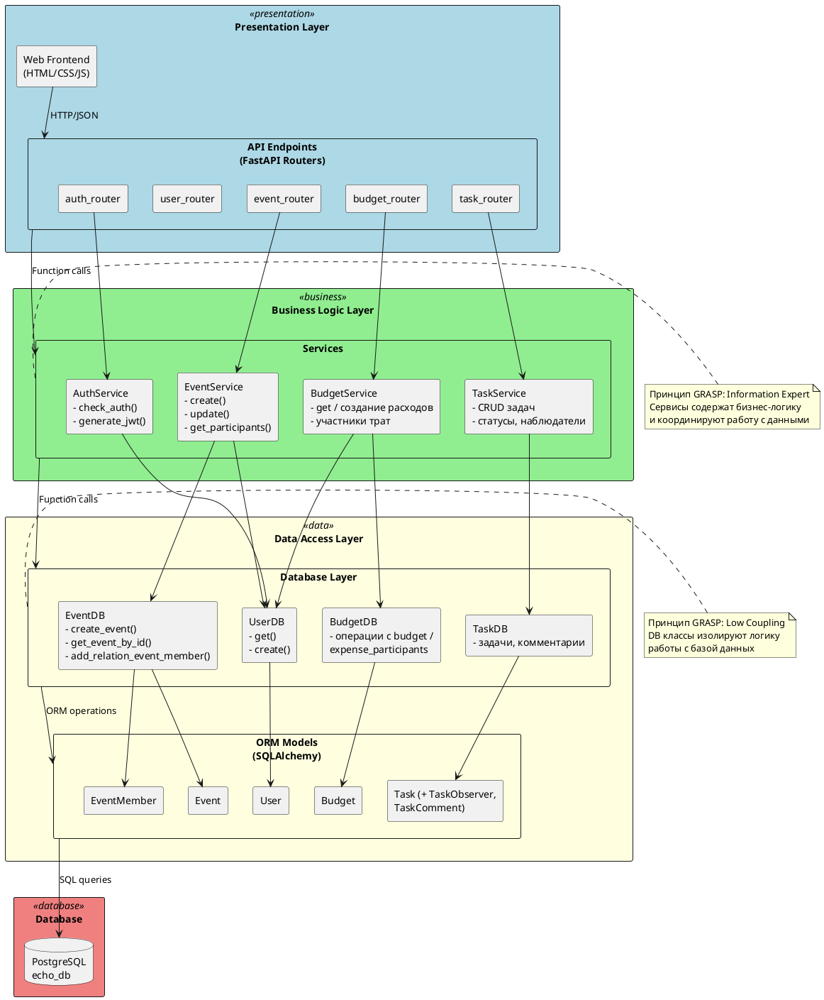
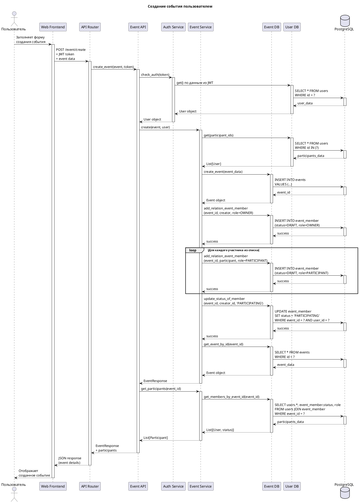
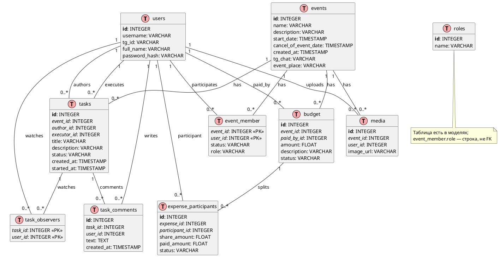

# Архитектура проекта Echo

## Описание проекта

Echo — веб-приложение для управления событиями и бюджетами. Приложение позволяет пользователям создавать события, управлять участниками, отслеживать бюджеты и расходы, вести задачи в рамках мероприятия.

Диаграммы и перечисления ниже приведены в соответствие с текущим кодом в репозитории (`app/src`, `docker/`, `requirements.txt`). Дополнительно к перечисленным роутерам в `app/src/api/api.py` подключён служебный модуль **`duty`** (например, `GET /ping`).

## Основные слои архитектуры

Архитектура приложения построена на основе трехслойной модели:

1. **Presentation Layer (Слой представления)** - Frontend (HTML/CSS/JS) + API endpoints (FastAPI)
2. **Business Logic Layer (Слой бизнес-логики)** - Services (EventService, BudgetService, TaskService, AuthService)
3. **Data Access Layer (Слой доступа к данным)** - Database layer (EventDB, UserDB, BudgetDB) + ORM Models (SQLAlchemy)

---

## 1. C4 Component Diagram (Level 3) - Ключевые компоненты

```plantuml
@startuml C4_Component_Diagram
!include https://raw.githubusercontent.com/plantuml-stdlib/C4-PlantUML/master/C4_Component.puml

LAYOUT_WITH_LEGEND()

title Component Diagram - Echo Application

Container_Boundary(api, "FastAPI Application") {
    Component(api_router, "API Router", "FastAPI", "Маршрутизация запросов к различным endpoints")
    Component(auth_api, "Auth API", "FastAPI Router", "Endpoints для аутентификации")
    Component(event_api, "Event API", "FastAPI Router", "Endpoints для управления событиями")
    Component(budget_api, "Budget API", "FastAPI Router", "Endpoints для управления бюджетами и расходами")
    Component(user_api, "User API", "FastAPI Router", "Endpoints для управления пользователями")
    Component(task_api, "Task API", "FastAPI Router", "Endpoints для задач мероприятия")
    
    Component(auth_service, "Auth Service", "Python Class", "Бизнес-логика аутентификации и авторизации")
    Component(event_service, "Event Service", "Python Class", "Бизнес-логика управления событиями")
    Component(budget_service, "Budget Service", "Python Class", "Бизнес-логика управления бюджетами")
    Component(task_service, "Task Service", "Python Class", "Бизнес-логика задач")
    
    Component(event_db, "Event DB", "Python Class", "Доступ к данным событий")
    Component(user_db, "User DB", "Python Class", "Доступ к данным пользователей")
    Component(budget_db, "Budget DB", "Python Class", "Доступ к данным бюджетов и долей расходов")
    Component(task_db, "Task DB", "Python Class", "Доступ к данным задач")
    
    ComponentDb(models, "ORM Models", "SQLAlchemy", "Event, User, Budget, EventMember и др.")
}

ContainerDb(database, "PostgreSQL", "PostgreSQL 17", "Хранение всех данных приложения (образ postgres:17 в Compose)")

Container(frontend, "Web Frontend", "HTML/CSS/JavaScript", "Пользовательский интерфейс")

Person(user, "Пользователь", "Пользователь приложения Echo")

Rel(user, frontend, "Использует", "HTTP/HTTPS")
Rel(frontend, api_router, "Делает API запросы", "JSON (через Nginx /api/ → backend)")

Rel(api_router, auth_api, "Маршрутизирует")
Rel(api_router, event_api, "Маршрутизирует")
Rel(api_router, budget_api, "Маршрутизирует")
Rel(api_router, user_api, "Маршрутизирует")
Rel(api_router, task_api, "Маршрутизирует")

Rel(auth_api, auth_service, "Использует")
Rel(event_api, event_service, "Использует")
Rel(event_api, auth_service, "Проверяет авторизацию")
Rel(budget_api, budget_service, "Использует")
Rel(budget_api, auth_service, "Проверяет авторизацию")
Rel(task_api, task_service, "Использует")
Rel(task_api, auth_service, "Проверяет авторизацию")

Rel(event_service, event_db, "Использует")
Rel(event_service, user_db, "Использует")
Rel(budget_service, budget_db, "Использует")
Rel(budget_service, user_db, "Использует")
Rel(task_service, task_db, "Использует")
Rel(auth_service, user_db, "Использует")

Rel(event_db, models, "Использует")
Rel(user_db, models, "Использует")
Rel(budget_db, models, "Использует")
Rel(task_db, models, "Использует")

Rel(models, database, "Читает/Записывает", "SQL/TCP")

@enduml
```

---

## 2. Deployment Diagram - Диаграмма развертывания

```plantuml
@startuml Deployment_Diagram
!include https://raw.githubusercontent.com/plantuml-stdlib/C4-PlantUML/master/C4_Deployment.puml

LAYOUT_WITH_LEGEND()

title Deployment Diagram - Echo Application

Deployment_Node(docker_host, "Docker Host", "Linux Server") {
    Deployment_Node(nginx_container, "Nginx Container", "Docker Container") {
        Container(nginx, "Nginx", "nginx:latest", "Веб-сервер для статических файлов и reverse proxy")
    }
    
    Deployment_Node(app_container, "App Container", "Docker Container") {
        Container(fastapi_app, "FastAPI Application", "Python 3.12 + FastAPI", "Backend приложение")
    }
    
    Deployment_Node(db_container, "PostgreSQL Container", "Docker Container") {
        ContainerDb(postgres, "PostgreSQL", "postgres:17", "База данных")
    }
    
    Deployment_Node(volume, "Docker Volume", "Persistent Storage") {
        ContainerDb(db_data, "db-data", "Volume", "Постоянное хранилище данных БД")
    }
}

Person(user, "Пользователь")

Rel(user, nginx, "Открывает веб-интерфейс", "HTTP:8001 (локально)")
Rel(nginx, fastapi_app, "Проксирует API запросы", "HTTP:8000")
Rel(fastapi_app, postgres, "Выполняет SQL запросы", "TCP:5432")
Rel(postgres, db_data, "Сохраняет данные")

note right of nginx
  Порты:
  - 8001:8001 (Frontend)
  
  Volumes:
  - ../newui:/usr/share/nginx/newui
  - nginx.conf
end note

note right of fastapi_app
  Порты:
  - 8000:8000 (API)
  
  Environment:
  - db_host=postgre-db
  - Переменные из .env
end note

note right of postgres
  Порты:
  - 5432:5432
  
  Environment:
  - POSTGRES_DB=echo_db
  - POSTGRES_USER=postgres
  - POSTGRES_PASSWORD=postgres
end note

@enduml
```

---

## 3. Layered Architecture Diagram - Слои архитектуры



---

## 4. Sequence Diagram - Создание события пользователем



---

## 5. Архитектурные решения и обоснования

### 5.1 Выбор монолитной архитектуры

**Решение:** Использована монолитная архитектура с разделением на слои.

**Обоснование:**
- Проект находится на стадии MVP
- Команда разработки небольшая
- Требования к масштабированию минимальны на текущем этапе
- Упрощенное развертывание и отладка
- Меньше накладных расходов на межсервисную коммуникацию

### 5.2 Трехслойная архитектура

**Решение:** Разделение на Presentation, Business Logic и Data Access слои.

**Обоснование:**
- Четкое разделение ответственности (GRASP: High Cohesion)
- Упрощенное тестирование каждого слоя независимо
- Возможность замены реализации одного слоя без влияния на другие (GRASP: Low Coupling)
- Соответствие принципу единственной ответственности (SRP)

### 5.3 Использование FastAPI

**Решение:** FastAPI в качестве веб-фреймворка.

**Обоснование:**
- Высокая производительность (async/await)
- Автоматическая генерация OpenAPI документации
- Встроенная валидация данных через Pydantic
- Современный подход к разработке API
- Поддержка dependency injection

### 5.4 PostgreSQL как основная БД

**Решение:** PostgreSQL для хранения данных.

**Обоснование:**
- ACID-совместимость для критичных данных (события, бюджеты)
- Поддержка сложных запросов и JOIN операций
- Надежность и зрелость решения
- Хорошая интеграция с SQLAlchemy ORM

### 5.5 Docker Compose для развертывания

**Решение:** Использование Docker Compose для оркестрации контейнеров.

**Обоснование:**
- Упрощенное развертывание всего стека
- Изоляция зависимостей
- Воспроизводимость окружения
- Легкость масштабирования в будущем

---

## 6. Применение принципов GRASP

### 6.1 Information Expert

**Применение:** Каждый сервис (EventService, BudgetService) является экспертом в своей предметной области.

**Пример:**
```python
class EventService:
    async def create(self, event: CreateEventRequest, user: User):
        # EventService знает, как создать событие
        # и управлять участниками
        participants = [await self._user_db.get(User(id=uid)) 
                       for uid in event.participants]
        event = await self._event_db.create_event(...)
        await self._event_db.add_relation_event_member(event.id, user, "OWNER")
        for p in participants:
            await self._event_db.add_relation_event_member(event.id, p, "PARTICIPANT")
```

### 6.2 Low Coupling

**Применение:** Слои взаимодействуют через четко определенные интерфейсы.

**Пример:**
- API слой зависит только от сервисов, не знает о БД
- Сервисы зависят от DB классов, не знают о деталях SQL
- DB классы инкапсулируют работу с базой данных

### 6.3 High Cohesion

**Применение:** Каждый класс имеет четко определенную ответственность.

**Пример:**
- `EventDB` - только операции с БД для событий
- `EventService` - только бизнес-логика событий
- `EventAPI` - только обработка HTTP запросов для событий

### 6.4 Controller

**Применение:** API роутеры выступают в роли контроллеров.

**Пример:**
```python
@router.post("/create")
async def create_event(
    event: CreateEventRequest,
    event_service: EventService = Depends(EventService.get_as_dependency),
    user: User = Depends(AuthService.check_auth),
) -> EventResponse:
    # Контроллер координирует вызовы сервисов
    event_response = await event_service.create(event, user)
    participants = await event_service.get_participants(event_response.id)
    return event_response
```

### 6.5 Creator

**Применение:** Фабричные методы для создания зависимостей.

**Пример:**
```python
@classmethod
@cache
def get_as_dependency(cls):
    return cls(
        EventDB.get_as_dependency(),
        UserDB.get_as_dependency(),
    )
```

---

## 7. Технологический стек

### Backend
- **Framework:** FastAPI ~0.119 (см. `requirements.txt`)
- **Language:** Python 3.12 (образ Docker; локально — 3.12+)
- **ORM:** SQLAlchemy ~2.0.x (async, драйвер asyncpg)
- **Validation:** Pydantic ~2.12 + pydantic-settings
- **ASGI Server:** Uvicorn

### Database
- **Primary DB:** PostgreSQL 17 (образ в `docker/docker-compose.yml`)
- **Future:** Redis (для кэширования)

### Frontend
- **Core:** HTML5, CSS3, JavaScript (ES6+)
- **Future:** React/Vue.js для SPA

### Infrastructure
- **Containerization:** Docker
- **Orchestration:** Docker Compose
- **Web Server:** Nginx
- **Future:** Kubernetes для production

### Development
- **Version Control:** Git
- **CI:** GitHub Actions — workflow `.github/workflows/linter.yml` (Super-Linter: JS + Python Black на push в ветки, кроме `main`)
- **Future:** Тесты (pytest, coverage), расширенный CI/CD

---

## 8. Диаграмма базы данных

Ниже — упрощённая схема, согласованная с ORM-моделями в `app/src/models/`. Имя таблицы участников события в коде — **`event_member`** (составной первичный ключ). Таблица **`budget`** хранит отдельные расходы (сумма, автор оплаты `paid_by_id`, статус траты); доли участников — в **`expense_participants`** (поле `expense_id` ссылается на `budget.id`). У задач нет поля `deadline` в модели; есть `created_at`, `started_at`, связи **task_observers** и **task_comments**. Таблица **`roles`** объявлена в коде, но роли участников события в **`event_member`** хранятся строкой (`OWNER`, `PARTICIPANT`, `ADMIN` и т.д.), без FK на `roles`.


